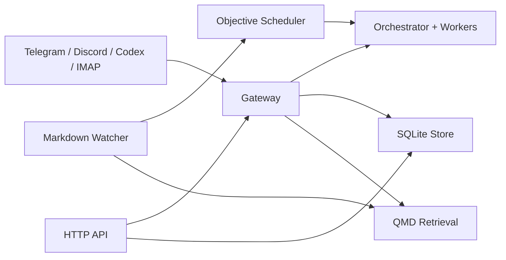

# agent-runtime

Security-first, cloud-agnostic runtime for multi-channel agent operations.

`agent-runtime` connects chat and tool channels to a shared control plane with
routing, approvals, background task execution, workspace memory, and markdown
retrieval.

## Status

- Current version: `0.1.0`
- Stability: early OSS release (pre-1.0)

## Key Capabilities

- Multi-channel connectors: Telegram, Discord, Codex/Cline/Gemini pattern, IMAP
- Command + natural-language task routing
- Human approval gates for sensitive actions
- Objective scheduler for recurring/event-driven proactivity
- Workspace-scoped markdown retrieval with qmd
- Admin TUI and HTTP API for operations

## Architecture



For more detail: [Architecture](docs/architecture.md).

## Quickstart (5 Minutes)

1. Prepare env:

```bash
cp .env.example .env
```

2. Run locally:

```bash
make run
```

3. Verify:

```bash
curl -fsS http://localhost:8080/healthz
curl -fsS http://localhost:8080/readyz
```

4. Optional: run TUI:

```bash
make tui
```

5. Optional: run Compose stack:

```bash
make compose-up
```

## First End-to-End Smoke Test

Use a connected channel (or Codex CLI flow) and run:

```text
/status
```

Then:

```text
/task run a hello-world runtime check and summarize results
```

Check artifacts under `data/workspaces/<workspace-id>/`.

## Commands at a Glance

Primary operator/admin commands:

- `/task <prompt>`
- `/search <query>`
- `/open <path-or-docid>`
- `/status`
- `/monitor <goal>`
- `/admin-channel enable`
- `/pending-actions`
- `/approve-action <action-id>`
- `/deny-action <action-id> [reason]`
- `/route <task-id> <question|issue|task|moderation|noise> [p1|p2|p3] [due-window]`

Full channel setup and command behavior: [Channel Setup](docs/channels/README.md).

## API Endpoints

- `GET /healthz`
- `GET /readyz`
- `GET /api/v1/heartbeat`
- `GET /api/v1/info`
- `POST /api/v1/chat`
- `GET/POST /api/v1/tasks`
- `POST /api/v1/tasks/retry`
- `POST /api/v1/pairings/start`
- `GET /api/v1/pairings/lookup?token=<token>`
- `POST /api/v1/pairings/approve`
- `POST /api/v1/pairings/deny`
- `GET/POST /api/v1/objectives`
- `POST /api/v1/objectives/update`
- `POST /api/v1/objectives/active`
- `POST /api/v1/objectives/delete`

Detailed payloads and response examples: [API Reference](docs/api.md).

## Security Model (Summary)

- Admin/API access is intended to be protected by mTLS.
- Sensitive actions require explicit approval.
- Command execution is sandboxed and allowlist-based.
- Channel identities are linked through one-time pairing tokens.

Operational hardening: [Production Checklist](docs/production-checklist.md).

## Documentation

Start here: [Docs Index](docs/README.md)

- Getting started: [Getting Started](docs/getting-started.md)
- Install: [Install](docs/install.md)
- Configuration: [Configuration](docs/configuration.md)
- Operations: [Operations](docs/operations.md)
- API reference: [API Reference](docs/api.md)
- Development: [Development Guide](docs/development.md)

## Contributing

- Contribution guide: [CONTRIBUTING.md](CONTRIBUTING.md)
- Code of conduct: [CODE_OF_CONDUCT.md](CODE_OF_CONDUCT.md)
- Security policy: [SECURITY.md](SECURITY.md)
- Support: [SUPPORT.md](SUPPORT.md)
- Changelog: [CHANGELOG.md](CHANGELOG.md)

## License

MIT. See [LICENSE](LICENSE).
