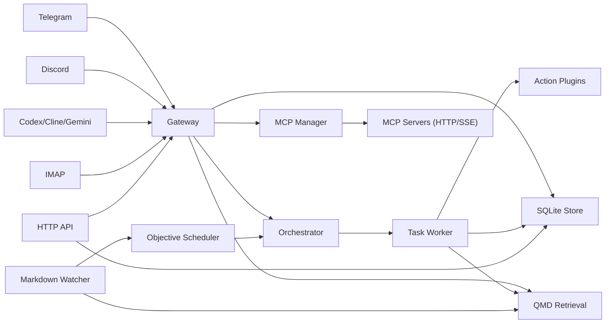

# Architecture Overview

`agent-runtime` is a channel-first control plane that accepts messages, applies
policy and routing, executes tasks, and persists workspace artifacts.

## Runtime Responsibilities

- `gateway`: command parsing, triage, approval handling, and tool dispatch
- `orchestrator`: queueing and running background tasks
- `store`: task/context/objective/action persistence
- `connectors`: external channel adapters
- `mcp`: MCP server lifecycle, discovery, refresh, and dynamic tool registration
- `qmd`: workspace markdown indexing and retrieval
- `scheduler`: recurring objectives and event-based objective triggers
- `httpapi`: programmatic admin and automation interface

## Admin TUI Architecture

The admin TUI is a fullscreen Bubble Tea control plane with three persistent
zones:
- `sidebar`: view navigation (`Overview`, `Pairings`, `Objectives`, `Tasks`, `Activity`)
- `workbench`: primary interactive surface (tables/forms/actions)
- `inspector`: detail and health context for the current selection

UI components are built with `bubbles` and `lipgloss`, while all operational
actions continue to call the same admin HTTP APIs (no backend schema changes).

## Persistence and Artifacts

- metadata DB: `/data/agent-runtime/meta.sqlite`
- workspace artifacts: `/data/workspaces/<workspace-id>/...`
- chat logs: `/data/workspaces/<workspace-id>/logs/chats/...`
- task outputs: `/data/workspaces/<workspace-id>/tasks/YYYY/MM/DD/...`
